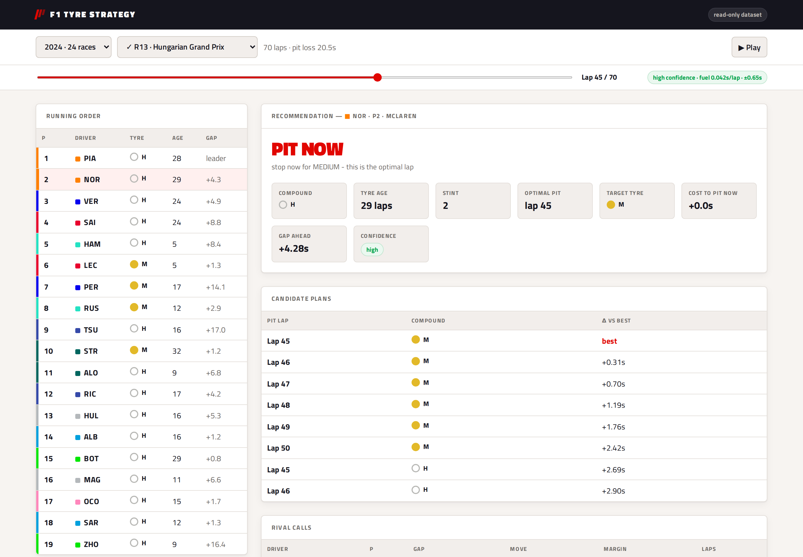
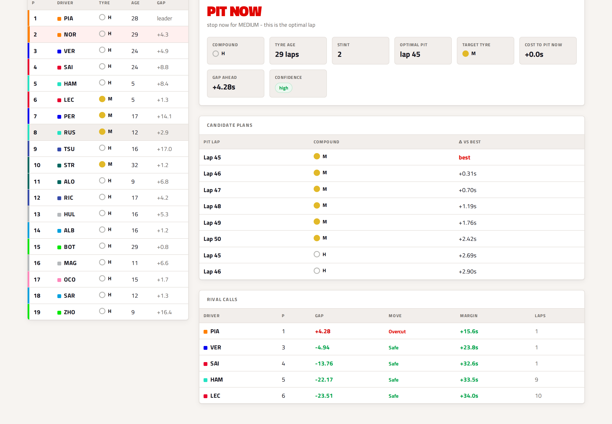
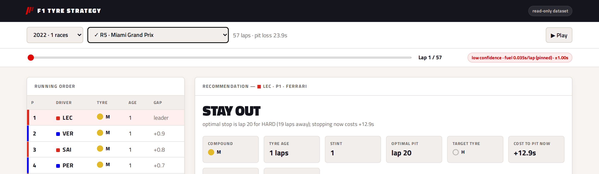

# F1 Tyre Strategy Engine

**[Live demo →](https://mq1yvieau8.execute-api.us-east-1.amazonaws.com)**

Replays a historical Formula 1 race lap by lap and recommends tyre strategy for
any car: when to pit, which compound to fit, and whether an undercut or overcut
is available against nearby rivals.



Recommendations are **causal**. At lap N the engine sees only laps 1..N, so a
replayed call is a genuine decision rather than hindsight. This is enforced
structurally: the pace model is fit on a prefix of the race and the strategy
search never touches the full dataset.

Above: Hungary 2024, lap 45. Norris is 4.3s behind Piastri on 29-lap-old hards.
The engine calls the stop for mediums, and rates the gap to Piastri as an overcut
opportunity rather than an undercut — the pit loss is larger than the time it
could claw back before Piastri responds.



Every round of every season from 2018 is selectable. Races already downloaded are
marked; anything else is fetched on demand.



---

## The modelling problem

Lap time is modelled as

```
lap_time = base_pace(compound) + deg_rate(compound) × tyre_age
           − fuel_effect × laps_completed
```

**Fuel burn masks degradation.** Raw lap times get *faster* through a stint as the
car sheds ~50kg. At Zandvoort 2024 Sargeant's hard-tyre laps (~75.5s) are quicker
than his mediums (~77.5s) purely from fuel load. Fit naively, a model concludes
tyres improve with age.

**Fuel and tyre age are collinear early on.** Before anyone pits, `tyre_age` and
`laps_completed` are the same number, so the two effects cannot be separated. A
plain OLS fit at lap 20 returned a fuel effect of 0.094 s/lap (~2.5× physical
reality) and inverted the compound ordering, claiming mediums degrade faster than
softs. That is exactly the moment the engine matters most — a first stop falls
around laps 15–25 — so the naive fit is worst when it is needed most.

Two fixes, both in `model.py`:

1. **Pin the fuel term** to a physical prior until stint offsets across the field
   vary enough to identify it (`std(lap − tyre_age) ≥ 9`).
2. **Ridge-regularise the slopes** toward physical priors, decaying as clean laps
   accumulate. Base pace is left unpenalised.

### Results

Out-of-sample validation over 41 dry races (`validate.py`) — fit through lap N,
predict laps N+1..N+5:

| | weak penalty | tuned |
|---|---|---|
| MAE | 1.032 s | **0.626 s** |
| compound ordering physically correct | 51% | **96%** |

Early-race fits went from worst to best (lap 15 MAE 0.573 s), which was the point.

**An uncomfortable finding:** MAE plateaus under heavier shrinkage, meaning
per-race degradation rates carry little reliable signal — the physical priors
predict about as well as the data does. What genuinely adapts per race is *base
pace*. The model is honest about this rather than claiming to learn degradation
curves per race.

### Backtest against real teams

77 drivers across 8 dry races (`backtest.py`), engine's pit window vs. actual
first stop:

- median error **−1.0 laps** (essentially unbiased)
- **64%** within 5 laps, **84%** within 10 laps
- best: Bahrain (MAE 1.9 laps, 93% within 5)

Teams are not a perfect oracle — they react to safety cars, traffic and rivals the
engine cannot see — so agreement is evidence rather than proof.

---

## Architecture

Container image on Lambda, exposed through an API Gateway HTTP API. Race data and
season schedules are baked into the image: 47 races is ~1.5MB of Parquet, cheaper
and faster than an S3 round trip per request.

```
FastF1 ──▶ ingest ──▶ Parquet + catalog ──▶ pace model ──▶ strategy search ──▶ API ──▶ UI
                                                    (fit on laps 1..N only)
```

### What actually runs on AWS

The deployed system is small on purpose. Five services, each carrying real load:

| Service | Resource | What it does |
|---|---|---|
| **Lambda** | `f1-strategy-api` | The whole application. Container image, x86_64, 1536MB, 30s timeout. Memory is set for CPU rather than RAM — Lambda scales vCPU with memory and importing pandas dominates cold start; warm requests use ~200MB. |
| **ECR** | `f1-strategy-api` | Stores the image. Lifecycle policy expires untagged images after 14 days. |
| **API Gateway** | `f1-strategy-http` (HTTP API) | Public HTTPS endpoint, proxies everything to Lambda. |
| **IAM** | `f1-strategy-lambda-role` | Execution role. `AWSLambdaBasicExecutionRole` only — the read path touches no other service, so it needs nothing else. |
| **CloudWatch Logs** | `/aws/lambda/f1-strategy-api` | Created by Lambda automatically; where the function's output goes. |

Cold start ~0.33s, warm ~0.28s.

That is the whole deployed footprint. A CloudFront distribution and Origin Access
Control existed briefly while working around the blocked Function URL described
below; both have been deleted, along with the Lambda resource-policy statement
that let CloudFront invoke the function. `deploy/deploy-cdn.sh` is kept as a
working reference for the OAC pattern, but nothing runs it.

### What is not on AWS

**No S3, DynamoDB, SQS, Step Functions, ECS, or Kafka.** The account has zero of
each — verified, not assumed. Where this project needs the capability one of those
would provide, it uses a local implementation instead:

| Capability | What this project uses | Managed service it would map to |
|---|---|---|
| Race data storage | Parquet files, baked into the container image | S3 |
| Race index / catalog | `data/catalog.json`, mtime-cached | DynamoDB |
| Ingest job state | SQLite (`data/jobs.db`), local only | DynamoDB |
| Ingest queue | `queue.Queue` in-process, local only | SQS + dead-letter queue |
| Ingest workers | daemon threads, local only | Lambda consumers with reserved concurrency |
| Upstream throttling | rate limiter, 35 races/hour | Step Functions Map with a concurrency cap |

These are **working implementations, not mocks** — the queue really queues, the
workers really fetch, the limiter really throttles, and the whole path was verified
end to end by downloading a race that was not in the store. They are simply local:
they run when you run the app on your own machine, and none of them are part of the
deployed build, which serves a fixed dataset with ingest switched off.

The interfaces were written so that swapping in the managed services changes
implementations rather than the API. That is a design intention, not a completed
migration.

### Code layout

"Deployed" marks what the container image contains — the read path only. The
ingest and analysis tooling stays on your machine.

| File | Role | Deployed |
|---|---|:---:|
| `api.py` | FastAPI service | ✅ |
| `lambda_app.py` | Lambda entrypoint (Mangum ASGI adapter) | ✅ |
| `model.py` | Fuel-corrected degradation model | ✅ |
| `strategy.py` | Pit-window search, undercut/overcut analysis | ✅ |
| `dataio.py` | Storage boundary: load, repair, save, index | ✅ |
| `schedule.py` | Cached season schedules | ✅ |
| `static/index.html` | Front end | ✅ |
| `jobs.py` | Async ingest queue, worker pool, rate limiting | ⚠️ |
| `ingestcore.py` | FastF1 session → normalised lap table | — |
| `ingest.py` | Batch CLI over whole seasons | — |
| `validate.py` | Out-of-sample model validation | — |
| `backtest.py` | Recommendations vs. what teams actually did | — |
| `backfill_colors.py` | One-off livery backfill | — |
| `deploy/` | preflight, deploy, teardown scripts | — |

⚠️ `jobs.py` ships because `api.py` imports it, but it is inert: `F1_INGEST=off`
means no workers start and the ingest endpoints return 503. FastF1 itself is not
in the image at all — it pulls matplotlib, scipy and cryptography that the read
path never touches, so season schedules are pre-cached instead.

### On-demand ingest

A FastF1 race load takes 1–2 minutes uncached and the upstream API rate-limits at
**500 calls/hour** (~11 calls per race). No user waits that long on a dropdown, so
the API accepts a request, returns a job id, and a worker does the fetch.

This runs **locally only**. The queue, workers and rate limiter are real and
working — `jobs.py` deduplicates on race slug, backs off and retries on upstream
throttling, caps at three attempts, and resets a job to `queued` if the process
dies mid-fetch. None of it is deployed.

Download is switched off in the deployed build (`F1_INGEST=off`), because it needs
writable storage and a long-lived worker and a read-only serverless function has
neither. The UI detects the flag and says so rather than offering a button that
cannot work.

See [What is not on AWS](#what-is-not-on-aws) for how each local piece maps onto
the managed service it would become.

---

## Running it

```bash
python -m venv .venv && .venv/bin/pip install -r requirements-worker.txt
.venv/bin/uvicorn api:app --port 8000     # http://localhost:8000
```

Ingest more races (FastF1 rate-limits at 500 calls/hour):

```bash
.venv/bin/python ingest.py --years 2024 2025
```

## Deploying

```bash
bash deploy/preflight.sh     # checks credentials, docker, data, schedules
bash deploy/deploy-api.sh    # build, push to ECR, create/update the function
bash deploy/deploy-apigw.sh  # expose it through an HTTP API
bash deploy/teardown.sh      # remove everything so nothing keeps billing
```

**Cost.** Lambda's always-free tier covers 1M requests and 400,000 GB-seconds per
month. API Gateway gives 1M requests/month free for 12 months, then $1.00 per
million. ECR storage is ~$0.05/month for a 500MB image. At portfolio traffic the
whole thing is a few cents a month.

### Three deployment problems worth recording

None were obvious from their error messages.

**ECR rejected the lifecycle policy.** `imageCountMoreThanN` — the obvious "keep
last N images" rule — returns `matched 0 out of 4`, including in its newer
`tagPatternList` form, while `sinceImagePushed` is accepted. The policy now
expires untagged images, which is what actually reclaims space since each push
orphans the previous `latest`.

**Lambda rejected the image:** *"manifest, config or layer media type is not
supported"*. Buildx, the default builder since Docker 23, attaches provenance and
SBOM attestations, turning the push into a manifest list Lambda will not accept.
Fixed with `--provenance=false --sbom=false`.

**Public Function URLs are blocked in this account.** Every request returned 403
before the function was invoked, with a provably correct `AuthType=NONE` config
and resource policy. CloudFront with Origin Access Control — the pattern AWS
recommends instead — failed identically. Three observations pinned it down: a
manually SigV4-signed request from an IAM user returned 200, the function's log
group recorded that request but never a CloudFront one, and the account is not in
an Organization so no SCP explains it. The IAM user is authorised by an *identity*
policy while CloudFront relies solely on the *resource* policy, which the
account-level block appears to override. An API Gateway HTTP API avoids function
URLs altogether, invoking through `lambda:InvokeFunction` with the `apigateway`
principal.

---

## Colours

Team and compound colours come from FastF1 per session rather than a hardcoded
map, because liveries change: Hamilton is Mercedes teal in 2024 and Ferrari red in
2025, and Sainz goes Ferrari red to Williams blue.

The official palettes are designed for dark broadcast graphics, so the pale ones
(HARD is `#f0f0ec`, Haas `#b6babd`) disappear against a light background. The UI
darkens anything above a luminance threshold instead of substituting a different
colour, so the livery stays recognisable.

## Known limitations

- **No safety cars.** A stop under an SC is nearly free; the engine has no concept
  of one, which explains most large backtest disagreements.
- **No traffic model.** Rejoining into a train can erase an undercut. Track
  position is not valued, so recommendations are poor at Monaco-type circuits.
- **No rival reaction.** Optimises the driver's own race time; it does not simulate
  rivals responding, so it approximates rather than solves "highest finishing
  position".
- **Wet races decline to advise.** Crossover strategy is a track-drying problem,
  not a tyre-wear one. 6 of 47 ingested races are affected.
- **Pit loss falls back to 21 s** in 4 of 41 races that offer no representative
  green-flag stop — Monaco 2024's lap-1 red flag let the whole field change tyres,
  so every observation is a red-flag stop.
- **Some sessions lack tyre data entirely.** FastF1's timing-app feed carries
  stint, compound and tyre life together, and it is missing for 15 drivers across
  354 laps of Miami 2025. The engine declines to advise on those laps.
- **Degradation is linear.** Real tyres fall off a cliff; a linear fit understates
  very long stints.

## Data

Ships with 47 races (2024 ×24, 2025 ×21, 2026 ×1, plus one on-demand test). Any
race from 2018 onward is fetchable when running locally.

Data: [FastF1](https://github.com/theOehrly/Fast-F1). Not affiliated with Formula 1.
